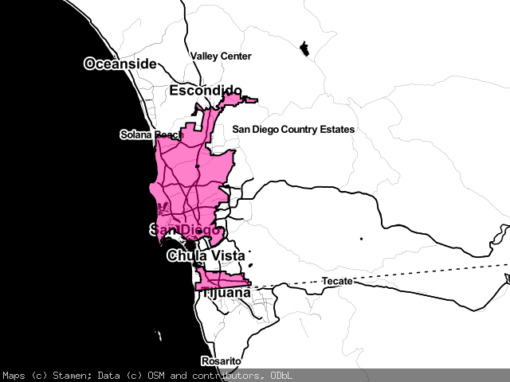

# go-whosonfirst-staticmap

Go package for rendering static maps of Who's On First places.

## Important

Too soon. Move along.

## Install

You will need to have both `Go` and the `make` programs installed on your computer. Assuming you do just type:

```
make bin
```

All of this package's dependencies are bundled with the code in the `vendor` directory.

## Example

_Note that all error handling has been removed for the sake of brevity._

```
import (
	"fmt"
	"github.com/whosonfirst/go-whosonfirst-staticmap"
	"image/png"		
	"log"
)

func main() {

	wofid := 85688637
	png := fmt.Sprintf("%d.png", wofid)
	
	sm, _ := staticmap.NewStaticMap(wofid)
	im, _ := sm.Render()

	fh, _ := os.Create(png)
	defer fh.Close()

	png.Encode(file, im)
}
```

## Tools

### wof-staticmap

Render a static map for a Who's On First ID from the command line.

```
./bin/wof-staticmap -h
Usage of ./bin/wof-staticmap:
  -data-root string
    	Where to look for Who's On First source data. (default "https://whosonfirst.mapzen.com/data")
  -height int
    	The height in pixels of your new map. (default 480)
  -id int
    	A valid Who's On First to render.
  -save-as string
    	Save the map to this path. If empty then the map will saved as {WOFID}.png.
  -width int
    	The width in pixels of your new map. (default 640)
```

### wof-staticmapd

Render a static map for a Who's On First ID from an HTTP pony, optionally caching the result in S3.

```
./bin/wof-staticmapd -h
Usage of ./bin/wof-staticmapd:
  -cache
    	Cache rendered maps
  -cache-provider string
    	A valid cache provider. Valid options are: s3 (default "s3")
  -data-root string
    	Where to look for Who's On First source data. (default "https://whosonfirst.mapzen.com/data")
  -gracehttp.log
    	Enable logging. (default true)
  -height int
    	The default height in pixels for rendered maps. (default 480)
  -host string
    	The hostname to listen for requests on (default "localhost")
  -port int
    	The port number to listen for requests on (default 8080)
  -s3-bucket string
    	A valid S3 bucket where cached files are stored. (default "whosonfirst.mapzen.com")
  -s3-credentials string
    	A string descriptor for your AWS credentials. Valid options are: env:;shared:PATH_TO_SHARED_CREDENTIALS_FILE:SHARED_CREDENTIALS_PROFILE; iam: (default "shared:/Users/asc/.aws/credentials:default")
  -s3-prefix string
    	An optional subdirectory (prefix) where cached files are stored in S3. (default "static")
  -s3-region string
    	A valid AWS S3 region (default "us-east-1")
  -size value
    	Zero or more custom {LABEL}={WIDTH}x{HEIGHT} parameters.
  -width int
    	The default width in pixels for rendered maps. (default 640)
```

## Examples

### Default sizes

```
./bin/wof-staticmapd 
curl http://127.0.0.1:8080/?id=1108794405
```


### Custom sizes

```
./bin/wof-staticmapd -size sq=100x100
curl http://127.0.0.1:8080/?id=1108794405&size=sq
```


### Cached maps

```
./bin/wof-staticmapd -cache -cache-provider s3 -s3-prefix static -size example=300x300
curl http://127.0.0.1:8080/?id=85922227&sz=example
curl http://whosonfirst.mapzen.com.s3.amazonaws.com/static/859/222/27/85922227.png
```



## See also

* https://github.com/flopp/go-staticmaps
